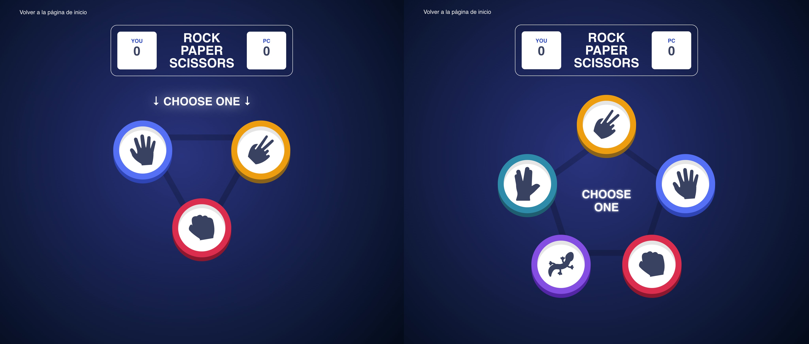

# Piedra-papel-tijeras-lagarto-spock

## Ejemplo en vivo

- [Ver página](https://rock-papper-scissors.onrender.com/)

## Descripción 📑 

Dos juegos creados con Javascript el primero el juego piedra, papel o tijera original y el segundo la versión piedra, papel, tijera, lagarto o Spock.

## ¿Qué he aprendido en este proyecto? 🙇🏻 

He aprendido a crear simplificar el uso de if en Javascript, y a reusar todo lo posible el código genrado, tanto en css como en js.

## Tecnologías 🛠 

<!-- Iconos sacados de: https://github.com/hendrasob/badges/blob/master/README.md y https://github.com/alexandresanlim/Badges4-README.md-Profile -->

>)

<!--  ## Vista previa del proyecto

Si quieres echar un vistazo al proyecto, te recomiendo:

 -->

## Autor ✒️

**Leticia de la Osa**

- [contacto@deletidev.com](mailto:contacto@deletidev.com)
- [LinkedIn](https://www.linkedin.com/in/deletidev)
- [Mi porfolio web](https://deletidev.com/)

## Instalación

Este proyecto necesita instalación, en la terminal escribir npm run dev y npm run preview.

## Licencia 📄 

MIT Public License v3.0
No puede usarse comercialmente.
